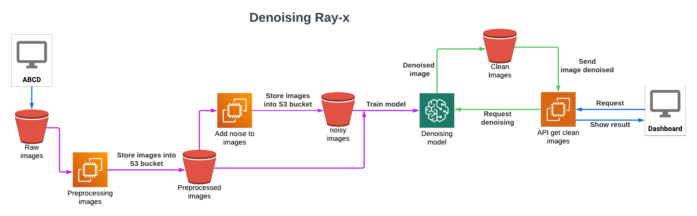

# Image denoising for radiographics.
We implemented an *Autoencoder neural network* to **enhance** the image quality of x-rays that are poorly taken, wrinkled, or other visual constraints. To simulate these visual constraints, we added Gaussian noise to the original images looking to reconstruct them with no noise.

For the computation, we used some AWS tools as EC2 instances, Sagemaker and S3 buckets.

# Data
We use the [MURA dataset](https://stanfordmlgroup.github.io/competitions/mura/) which consist of 40k multi-view radiographic images of upper extremity radiographic study types: elbow, finger, forearm, hand, humerus, shoulder, and wrist. 

# Repository structure
```
.
├── api/
├── app/
├── config/
├── data/                   # Data used in the project.
├── docs/                   # Documents for working backwards, architecture and presentation.
├── notebooks/              # Notebooks
├── scripts/                # Scripts 
├── README.md               # Project description
├── environments.yml        # YAML file that defines the environment and dependencies of the project 

```
# AWS Architecture


# Reproducibility
To ensure project reproducibility, execute the command `docker-compose up --build`.
